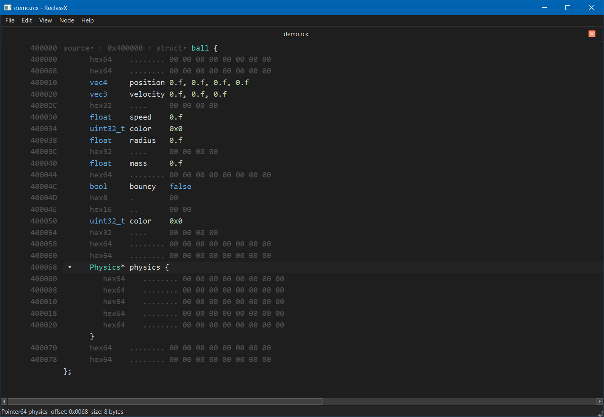

This tool helps you inspect raw bytes and interpret those as (int, float, struct, array, etc.) instead of just hex. It supports ptrs/arrays so you can see the relationship between data. And help deduce paths to these classes from long pointer chains. Either modify the values inside the editor or export as .h to reuse these structures in your code.

Video: https://github.com/IChooseYou/ReclassX/raw/main/video.mp4

QScintilla (github: https://github.com/brCreate/QScintilla) happens to be a really nice fit for our project.
We can treat parts of a line as a spans. It is very easy to implement inline editing. Additionally the syntax coloring and keyboard navigation were very useful also!

We hit some big milestones (plugin support with a first POC plugihn, first working linux build) however project is still currently a work in progress. Mainly developed/tested on windows (for now).

## Build

 1. Prerequisites

 - Qt 6 with MinGW - Qt Online Installer https://doc.qt.io/qt-6/qt-online-installation.html , note to select MinGW kit + CMake/Ninja from Tools section (online installers index: https://download.qt.io/official_releases/online_installers/)
 - CMake 3.20+ - https://cmake.org/download/ - bundled with Qt
 - windeployqt docs - https://doc.qt.io/qt-6/windows-deployment.html

 2. Quick Build (relies on powershell| for manual build skip to step 3)

 git clone --recurse-submodules https://github.com/IChooseYou/ReclassX.git
 cd ReclassX
 .\scripts\build_qscintilla.ps1
 .\scripts\build.ps1
   ^ script above tries to autodetect Qt install (as we learned not everyone installs to C:/Qt/)

 3. Manual Build

 Step by step for peoplewho want to run commands themselves:
 1. Clone with --recurse-submodules (+ fallback git submodule update --init --recursive)
 2. Build QScintilla: qmake + mingw32-make in third_party/qscintilla/src
 3. CMake configure + build with -DCMAKE_PREFIX_PATH
 4. optionallly windeployqt the exe

## Alternatives

 - ReClass.NET (reclass.net) - https://github.com/ReClassNET/ReClass.NET
 - ReClassEx - https://github.com/ajkhoury/ReClassEx
