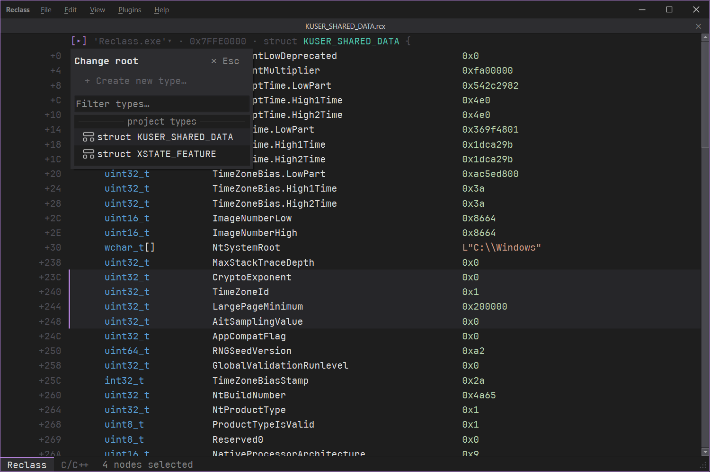
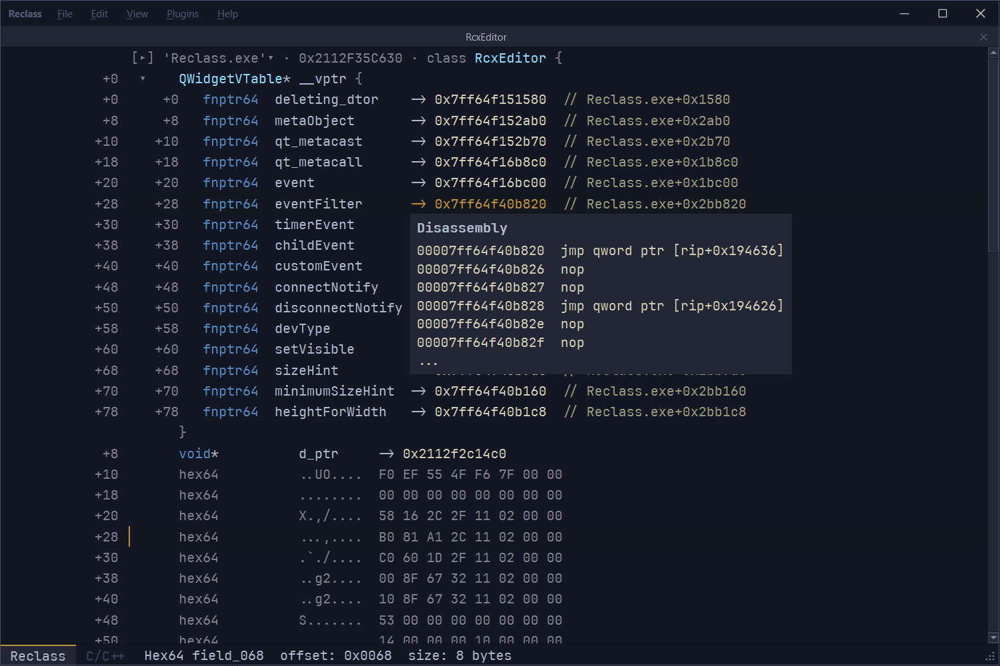
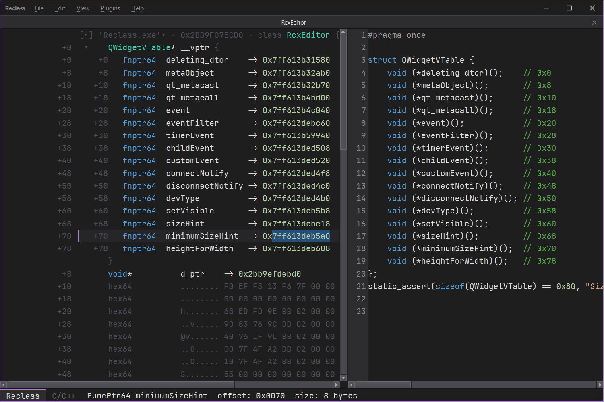

This tool helps you inspect raw bytes and interpret them as types (structs, arrays, primitives, pointers, padding) instead of just hex. It is essentially a debugging tool for figuring out unknown data structures either runtime or from some static source.







## State

- MCP (Model Context Protocol) bridge via `ReclassMcpBridge.exe`. The server starts by default and can be stopped from the File menu. It exposes all tool functionality to any MCP-compatible client (e.g. Claude Code) and falls back to UI prompts when the client requests something not yet covered by tools. To connect, add this to your MCP client config (e.g. `.mcp.json`):
  ```json
  {
    "mcpServers": {
      "ReclassMcpBridge": {
        "command": "path/to/build/ReclassMcpBridge.exe",
        "args": []
      }
    }
  }
  ```
## Build

 1. Prerequisites

 - Qt 6 with MinGW - Qt Online Installer https://doc.qt.io/qt-6/qt-online-installation.html , note to select MinGW kit + CMake/Ninja from Tools section (online installers index: https://download.qt.io/official_releases/online_installers/)
 - CMake 3.20+ - https://cmake.org/download/ - bundled with Qt
 - windeployqt docs - https://doc.qt.io/qt-6/windows-deployment.html

 2. Quick Build (relies on powershell| for manual build skip to step 3)

    git clone --recurse-submodules https://github.com/IChooseYou/Reclass.git
    cd Reclass
    .\scripts\build_qscintilla.ps1
    .\scripts\build.ps1
    ^ script above tries to autodetect Qt install (as we learned not everyone installs to C:/Qt/)

 3. Manual Build

 Step by step for peoplewho want to run commands themselves:
 1. Clone with --recurse-submodules (+ fallback git submodule update --init --recursive)
 2. Build QScintilla: qmake + mingw32-make in third_party/qscintilla/src
 3. CMake configure + build with -DCMAKE_PREFIX_PATH
 4. optionallly windeployqt the exe

## Alternatives

 - ReClass.NET (reclass.net) - https://github.com/ReClassNET/ReClass.NET
 - ReClassEx - https://github.com/ajkhoury/ReClassEx
